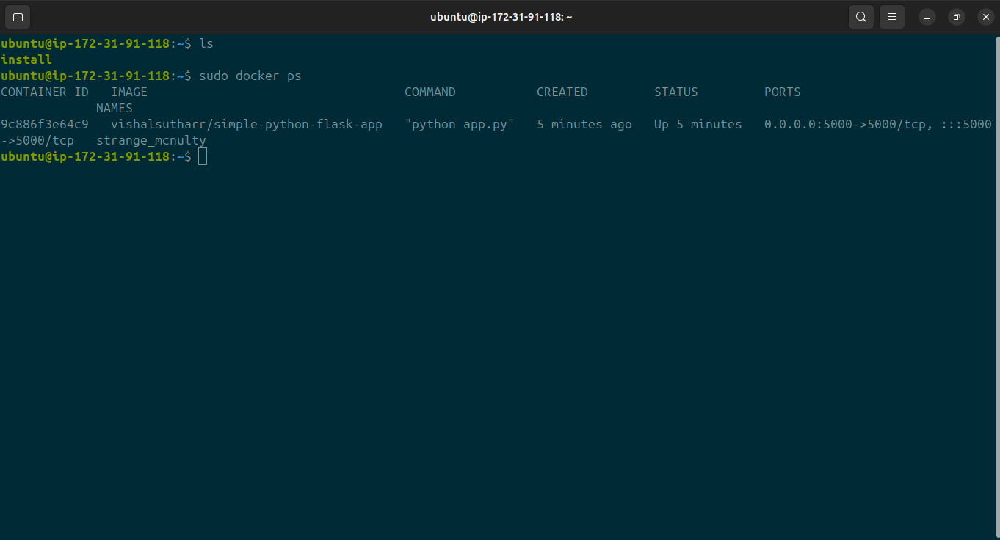

# AWS CI/CD Pipeline for Python Application

This project demonstrates how to set up a fully automated CI/CD pipeline on AWS using GitHub, AWS CodePipeline, CodeBuild, CodeDeploy, Amazon S3, Docker, and AWS Systems Manager. The pipeline automates the process of building, testing, and deploying a Python application to an EC2 instance.

## Architecture Overview


### Components:

- **GitHub**: Source code repository.
- **AWS CodePipeline**: Orchestrates the CI/CD workflow.
- **AWS CodeBuild**: Builds the application and generates artifacts.
- **Amazon S3**: Stores build artifacts.
- **Docker**: Containerizes the application.
- **AWS Systems Manager Parameter Store**: Stores Docker registry credentials securely.
- **AWS CodeDeploy**: Deploys the application to EC2 instances.

## Prerequisites

- An AWS account with necessary permissions.
- A GitHub repository containing your Python application's source code.
- An EC2 instance with the CodeDeploy agent installed.
- Docker installed on your local machine for building images.

## Setup Instructions

### 1. GitHub Repository

Create a GitHub repository to host your Python application's source code. Ensure that your repository contains:

- `app.py`: The main Python application file.
- `Dockerfile`: Defines the Docker image for your application.
- `buildspec.yml`: Specifies the build commands for AWS CodeBuild.

### 2. Amazon S3 Bucket


S3 bucket to store build artifacts generated by CodeBuild. Ensure that the bucket has appropriate permissions for CodeBuild to upload artifacts.


### 3. AWS Systems Manager Parameter Store

Store your Docker registry credentials securely in AWS Systems Manager Parameter Store:

- `docker_username`: Your Docker registry username.
- `docker_password`: Your Docker registry password.

### 4. AWS CodeBuild Project


Create a CodeBuild project with the following configuration:

- **Source**: Connect to your GitHub repository.
- **Environment**: Choose an appropriate build environment (e.g., Ubuntu).
- **Buildspec**: Use the `buildspec.yml` file from your repository.

### 5. Docker Image Build and Push

In your `buildspec.yml`, include commands to build and push the Docker image to your registry:

```yaml
version: 0.2

env:
  parameter-store:
    DOCKER_REGISTRY_USERNAME: /myapp/docker-credentials/username
    DOCKER_REGISTRY_PASSWORD: /myapp/docker-credentials/password
    DOCKER_REGISTRY_URL: /myapp/docker-registry/url
phases:
  install:
    runtime-versions:
      python: 3.11
  pre_build:
    commands:
      - echo "Installing dependencies..."
      - pip install -r requirements.txt
  build:
    commands:
      - echo "Running tests..."
      - echo "Building Docker image..."
      - echo "$DOCKER_REGISTRY_PASSWORD" | docker login -u "$DOCKER_REGISTRY_USERNAME" --password-stdin "$DOCKER_REGISTRY_URL"
      - docker build -t "$DOCKER_REGISTRY_URL/$DOCKER_REGISTRY_USERNAME/simple-python-flask-app:latest" .
      - docker push "$DOCKER_REGISTRY_URL/$DOCKER_REGISTRY_USERNAME/simple-python-flask-app:latest"
  post_build:
    commands:
      - echo "Build completed successfully!"
artifacts:
  files:
    - '**/*'
  base-directory: ./
```


### 6. AWS CodeDeploy Application


Create a CodeDeploy application and deployment group:

    Application: MyApp

    Deployment Group: MyApp-DeploymentGroup

        Deployment Type: In-place

        EC2 Tag: Application=MyApp

### 7. AWS CodePipeline


Create a CodePipeline with the following stages:

    Source: GitHub

        Connect to your GitHub repository.

        Choose the branch to monitor.

    Build: AWS CodeBuild

        Select the CodeBuild project created earlier.

    Deploy: AWS CodeDeploy

        Select the CodeDeploy application and deployment group.

### 8. Triggering the Pipeline

Push changes to your GitHub repository:

git commit -am "Update application"
git push origin main

This will trigger the pipeline, and AWS CodePipeline will automatically build and deploy the application.
Monitoring and Logs

    AWS CodePipeline: Monitor the pipeline's progress and view logs for each stage.

    AWS CloudWatch Logs: View detailed logs for CodeBuild and CodeDeploy.

### Output:



Cleanup

To avoid incurring charges:

    Delete the CodePipeline, CodeBuild project, and CodeDeploy application.

    Remove the S3 bucket and its contents.

    Delete the EC2 instance and associated resources.


## Connect with me:

- 📧 Email: [vishal123suthar2@gmail.com](mailto:vishal123suthar2@gmail.com)
- 🔗 LinkedIn: [linkedin.com/in/vishal-suthar-8317b4246](https://www.linkedin.com/in/vishal-suthar-8317b4246)