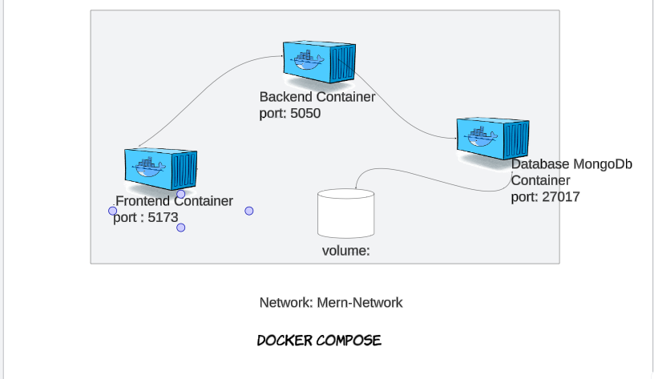
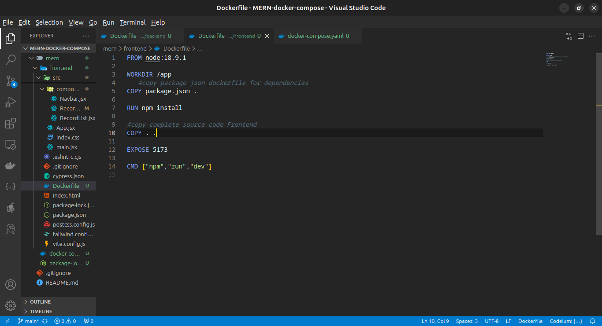
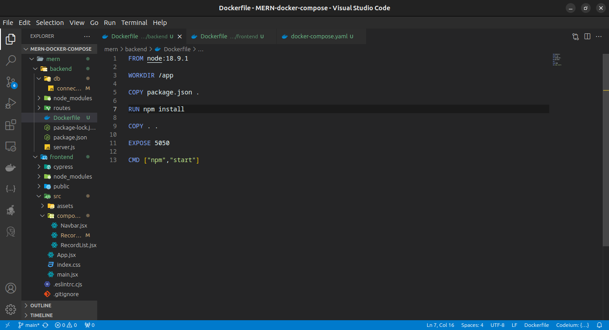
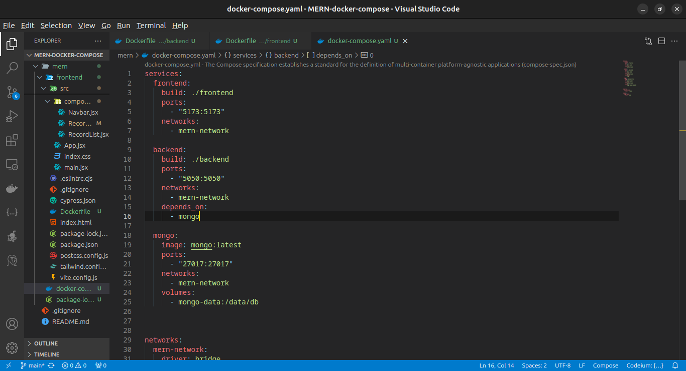
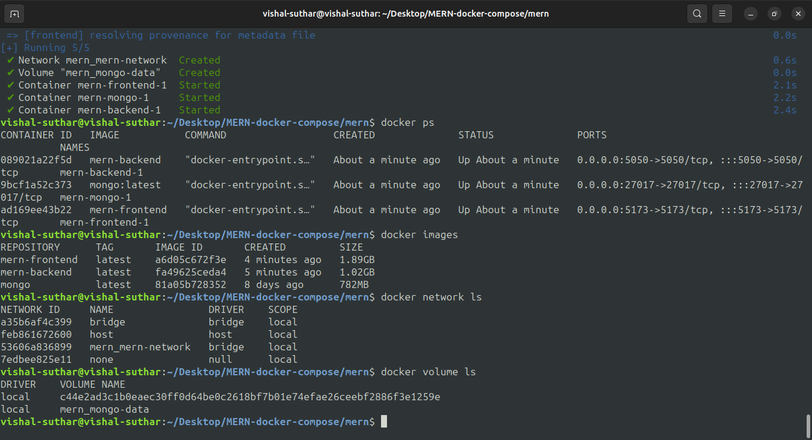
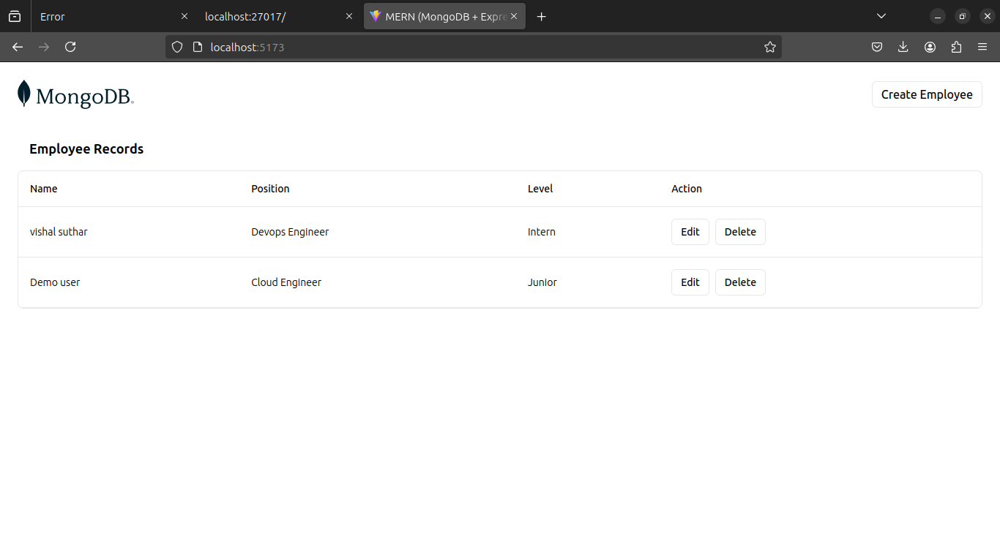

# MERN Stack Docker Compose Project

This project demonstrates how to containerize a MERN (MongoDB, Express, React, Node.js) stack application using Docker and Docker Compose. The goal is to create a scalable and easily manageable development environment for full-stack applications.

## Table of Contents

- [Architecture](#architecture)
- [Frontend Dockerfile](#frontend-dockerfile)
- [Backend Dockerfile](#backend-dockerfile)
- [Docker Compose Setup](#docker-compose-setup)
- [Overall State of All Setup](#overall-state-of-all-setup)
- [Application Output](#application-output)
- [Setup Instructions](#setup-instructions)

## Architecture

The architecture of the application consists of three main parts: the frontend, backend, and database. Each part runs in its own Docker container, ensuring modularity and ease of maintenance.

**Description**: The architecture diagram shows the interaction between the frontend (React), backend (Express/Node.js), and MongoDB database. All components are containerized using Docker, with Docker Compose orchestrating the setup.

## Frontend Dockerfile

The frontend Dockerfile defines the environment and setup required to run the React application.

**Description**: This Dockerfile image for the frontend shows the configuration used to containerize the React app. It specifies the base image, working directory, dependency installation, and the command to start the development server.

## Backend Dockerfile

The backend Dockerfile specifies the environment and setup for running the Express/Node.js application.

**Description**: The backend Dockerfile image shows how the Express server is containerized. It includes steps for setting the working directory, copying dependencies, installing required packages, and starting the backend server.

## Docker Compose Setup

The Docker Compose setup defines how to run the frontend, backend, and MongoDB containers together, allowing them to communicate over a shared network.

**Description**: This image illustrates the Docker Compose configuration used to bring up the entire stack. It includes service definitions for the frontend, backend, and MongoDB, along with their ports, dependencies, and network settings.

## Overall State of All Setup

This section shows the overall state of the project when all containers are up and running.

**Description**: This image displays the status of all running containers (frontend, backend, and MongoDB) and how they are interconnected. It confirms that the project is correctly configured and all services are running as expected.

## Application Output

A screenshot of the application's output showing how the frontend interacts with the backend.

**Description**: The output image demonstrates a typical user interface scenario where the React frontend interacts with the Express backend, displaying data retrieved from the MongoDB database. This output verifies the seamless integration of all components in the MERN stack.
