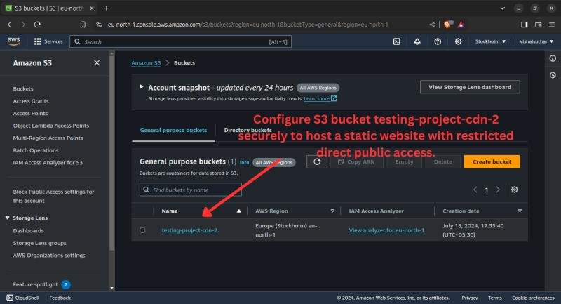
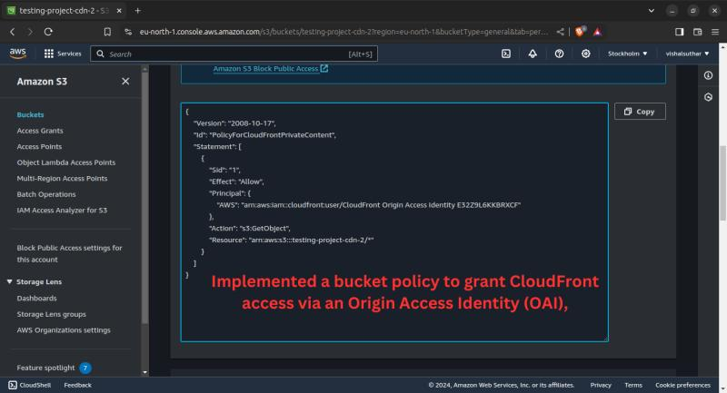
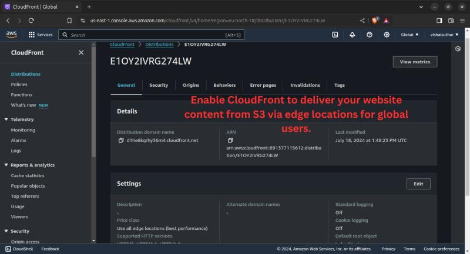
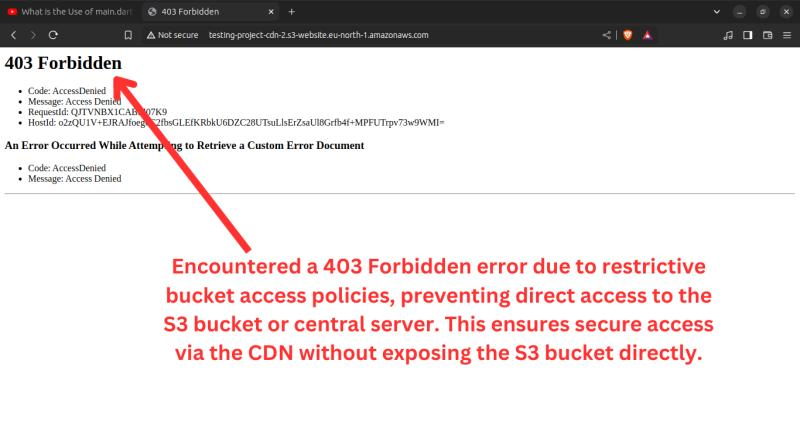
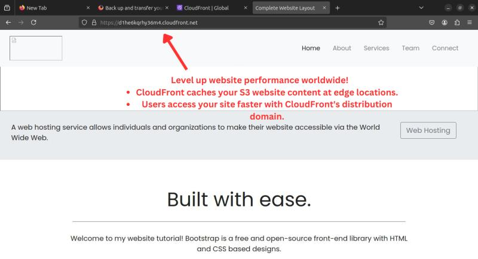

# 🚀 Secure Website Hosting with AWS S3 and CloudFront

This project demonstrates how to **securely host a static website** using **Amazon S3** and **Amazon CloudFront** with an **Origin Access Identity (OAI)** for enhanced performance and security.

---

## 🔐 Objective

To deploy a static website with:

- No direct public access to the S3 bucket.
- Secure content delivery using CloudFront.
- Global performance optimization through CDN edge locations.

---

## 🏗️ Architecture Overview


### Key Components:
- **Amazon S3**: Hosts static web files.
- **CloudFront**: Delivers content using CDN.
- **OAI**: Ensures only CloudFront can access S3.

---

## 🧱 Implementation Steps

### 1. 🔧 Configure the S3 Bucket



- Created a private bucket: `testing-project-cdn-2`.
- Enabled static website hosting.
- Disabled all public access settings.

---

### 2. 📝 Set Bucket Policy for CloudFront



Added a bucket policy to allow CloudFront access using **OAI**:

```json
{
  "Version": "2008-10-17",
  "Id": "PolicyForCloudFrontPrivateContent",
  "Statement": [
    {
      "Sid": "1",
      "Effect": "Allow",
      "Principal": {
        "AWS": "arn:aws:iam::cloudfront:user/CloudFront Origin Access Identity E3ZZ9L6K8KBRCXF"
      },
      "Action": "s3:GetObject",
      "Resource": "arn:aws:s3:::testing-project-cdn-2/*"
    }
  ]
} 
```


### 3. 🌐 Set Up CloudFront Distribution




- Created CloudFront distribution.

-  Linked the S3 bucket as the origin.

- Selected the created OAI to restrict S3 access.

- Configured caching, error handling, and          distribution settings.

### 4. 🚫 Verify Bucket Security



Attempted direct access to S3 files and received a 403 Forbidden response, confirming:

- S3 bucket security is enforced.
- Access is restricted to CloudFront only.
- Unauthorized access attempts are blocked.

### 5. 🌐 Access Webpage via CDN Edge



- Successfully accessed the website using a CloudFront URL.
- Global edge locations ensure fast content delivery.


### 🌟 Benefits

-    🔐 Enhanced Security – Blocks public S3 access.

-  ⚡ High Performance – Global edge locations reduce  latency.

-    📈 Scalability – Handles sudden traffic spikes easily.

-   🛡️ Built-in DDoS Protection – Secured by AWS Shield.

 -   🔄 Efficient Caching – Reduces load on origin (S3).


## Connect with me:


- 📧 Email: [vishal123suthar2@gmail.com](mailto:vishal123suthar2@gmail.com)
- 🔗 LinkedIn: [linkedin.com/in/vishal-suthar-8317b4246](https://www.linkedin.com/in/vishal-suthar-8317b4246)

