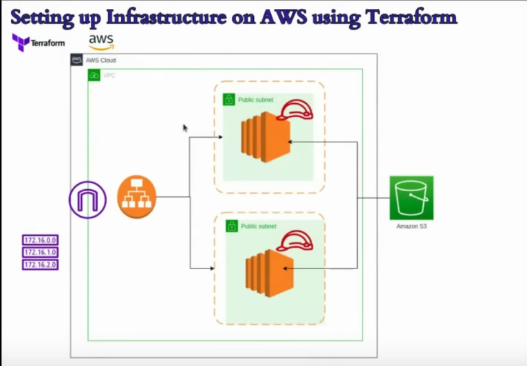
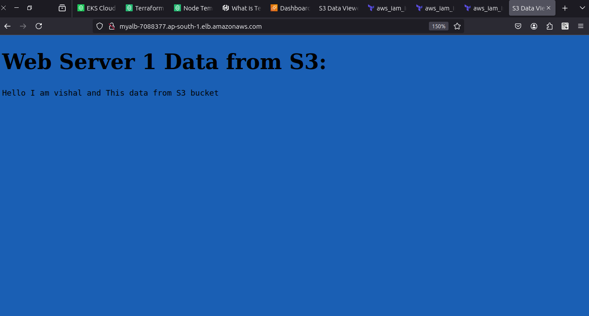
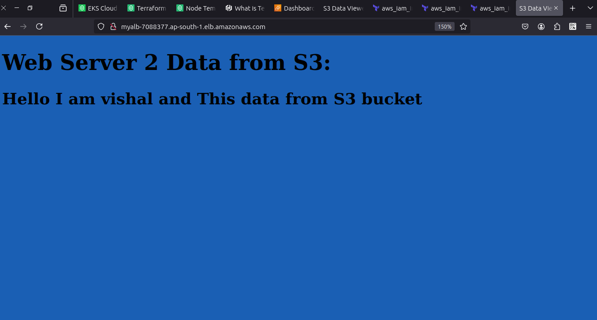

# 🚀 AWS Terraform Infrastructure Automation Project

Welcome to my AWS Infrastructure Automation project using Terraform! This project showcases how to build a scalable, secure, and highly available environment on AWS using Infrastructure as Code (IaC).

## ✅ What I Built

This project demonstrates the creation of a basic web infrastructure setup using Terraform, including:

    🖥️ Two EC2 Instances: Deployed across two public subnets for high availability.

    🌐 Application Load Balancer (ALB): Distributes traffic evenly between EC2 instances to improve reliability and scalability.

    🔐 Secure S3 Bucket: Used for file storage with access controlled via IAM Roles and Policies.

    🌐 Fully Automated VPC Setup:

        VPC

        Internet Gateway

        Route Tables

        Security Groups

All components are provisioned and configured automatically using Terraform.

## Ec2-1

## Ec2-2

## 🛠️ Terraform Highlights

    All resources are defined in HCL for complete reproducibility.

    Includes user data scripts to configure EC2 instances during boot.

    Output values provide quick access to:

        EC2 public IPs

        ALB DNS name

    Follows best practices for:

        Security group rules

        IAM role creation

        Resource tagging

## Connect with me:

- 📧 Email: [vishal123suthar2@gmail.com](mailto:vishal123suthar2@gmail.com)
- 🔗 LinkedIn: [linkedin.com/in/vishal-suthar-8317b4246](https://www.linkedin.com/in/vishal-suthar-8317b4246)