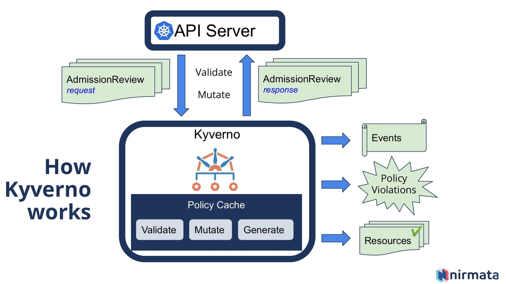
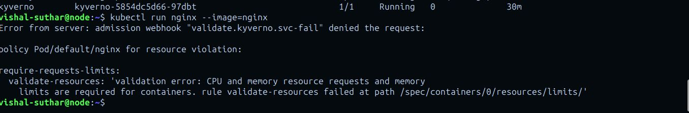

# 🚀 Exploring Kubernetes Security & Policy Management with Kyverno


## Overview

Kyverno is a Kubernetes-native policy engine that helps simplify and streamline cluster governance. This project documents my journey into managing security and policy in Kubernetes using YAML-based configurations via Kyverno.

## How it WORK

⚙️ How It Works




Kyverno acts as a Kubernetes admission controller, which means it intercepts requests to the Kubernetes API server before the objects are persisted in the cluster.

Here’s the workflow:

    User Creates or Updates a Resource:
    A developer tries to create a new Pod or Deployment, for example.

    Kyverno Intercepts the Request:
    Kyverno checks the incoming resource against its configured policies.

    Policy Actions Are Taken:
    Based on the policy type:

        Validation Policy: Checks if resource requests and limits are defined. If not, it can deny the request or log a warning (depending on the mode).

        Mutation Policy: Automatically adds missing resource limits if they're not specified.

        Generation Policy: (Not used here, but can auto-generate configs like NetworkPolicies or ConfigMaps).

    Audit vs Enforce Mode:

        Audit: Logs violations but allows the resource to be created. Great for testing.

        Enforce: Denies the resource if it violates the policy.

    Resource Is Allowed or Denied:
    Based on the results, the resource is either accepted and saved in the cluster, or rejected with an error message.

This approach ensures that all workloads in your cluster follow consistent standards without manual checks. ✅


## What I Did

1. Understood Kyverno Basics: Learned how Kyverno integrates with Kubernetes and simplifies policy management using declarative configurations.
2. Custom Policy Creation: Developed and applied policies that automatically add or validate resource requests and limits for workloads.
3. Policy Modes: Experimented with both audit and enforce modes to test policies and ensure compliance without disrupting development flows.
4. Cluster Integration: Seamlessly integrated policies into a live Kubernetes cluster to enhance reliability, efficiency, and governance.




---

### sample Yaml 

Source : - [More Kyverno Examples](https://lnkd.in/dwYC2Bbx)

```

apiVersion: kyverno.io/v1
kind: ClusterPolicy
metadata:
  name: require-requests-limits
  annotations:
    policies.kyverno.io/title: Require Limits and Requests
    policies.kyverno.io/category: Best Practices, EKS Best Practices
    policies.kyverno.io/severity: medium
    policies.kyverno.io/subject: Pod
    policies.kyverno.io/minversion: 1.6.0
    policies.kyverno.io/description: >
      As application workloads share cluster resources, it is important to limit resources
      requested and consumed by each Pod. It is recommended to require resource requests and
      limits per Pod, especially for memory and CPU. If a Namespace level request or limit is specified,
      defaults will automatically be applied to each Pod based on the LimitRange configuration.
      This policy validates that all containers have something specified for memory and CPU
      requests and memory limits.
spec:
  validationFailureAction: Audit
  background: true
  rules:
    - name: validate-resources
      match:
        any:
          - resources:
              kinds:
                - Pod
      validate:
        message: "CPU and memory resource requests and memory limits are required for containers."
        pattern:
          spec:
            containers:
              - resources:
                  requests:
                    memory: "?*"
                    cpu: "?*"
                  limits:
                    memory: "?*"
            =(initContainers):
              - resources:
                  requests:
                    memory: "?*"
                    cpu: "?*"
                  limits:
                    memory: "?*"
            =(ephemeralContainers):
              - resources:
                  requests:
                    memory: "?*"
                    cpu: "?*"
                  limits:
                    memory: "?*"
```

## Why It Matters

Like any well-governed system, a Kubernetes cluster thrives with rules and structure. Kyverno helps enforce these rules, ensuring that applications are both compliant and efficient, reducing the risk of resource misuse or outages.

This project is a testament to how policy enforcement is crucial for secure and efficient cluster management.

## Repository Resource :


- [More Kyverno Examples](https://lnkd.in/dwYC2Bbx)


## Connect with me:

- 📧 Email: [vishal123suthar2@gmail.com](mailto:vishal123suthar2@gmail.com)
- 🔗 LinkedIn: [linkedin.com/in/vishal-suthar-8317b4246](https://www.linkedin.com/in/vishal-suthar-8317b4246)
