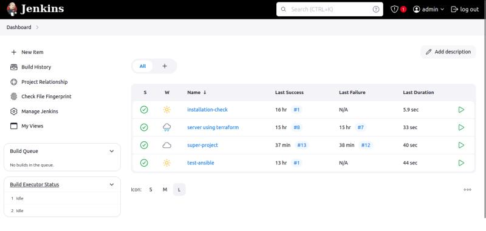
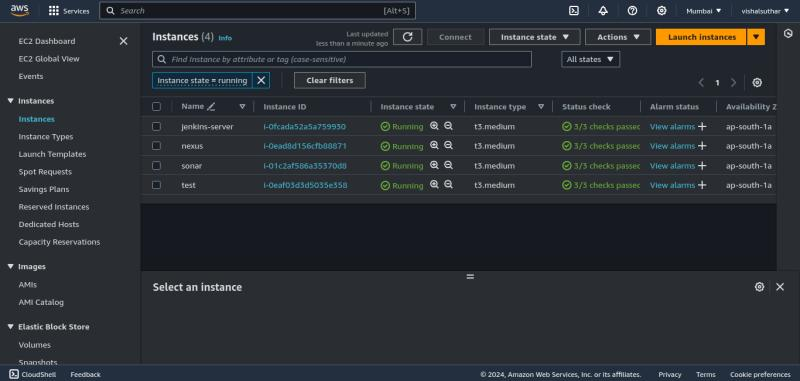
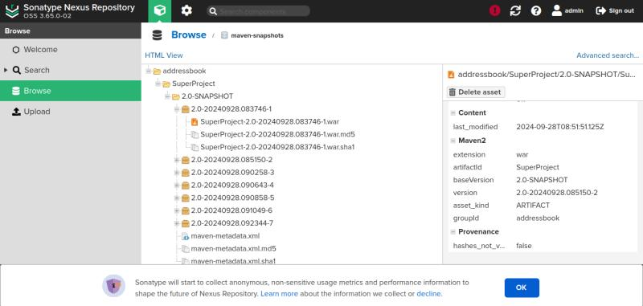
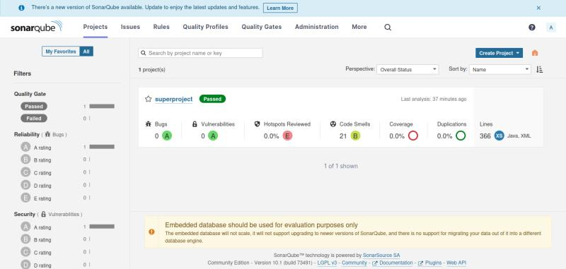
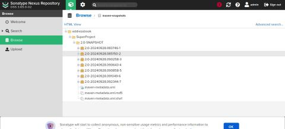
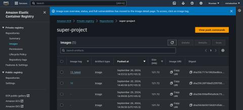

CI/CD Pipeline Implementation: Jenkins, AWS, Docker, Terraform & Kubernetes
============================================================

What I Built
------------

I created a fully automated CI/CD pipeline using Jenkins on AWS EC2, integrating multiple DevOps tools to streamline software delivery from code commit to production deployment.

Key Components
---------------

### Jenkins Server

Configured on EC2 for pipeline orchestration

### Source Control

GitHub for code management

### Build Tool

Maven for Java application building

### Quality Gates

SonarQube for code quality analysis

### Artifact Management

Nexus Repository for storing build artifacts

### Containerization

Docker for application packaging

### Container Registry

AWS ECR for image storage

### Infrastructure

AWS EC2 instances provisioned with Terraform

### Configuration

Ansible for automated server setup

### Deployment

Kubernetes (AWS EKS) for container orchestration

Implementation Process
--------------------

### Infrastructure Setup

* Provisioned EC2 instances for Jenkins, SonarQube, and Nexus using Terraform
* Configured servers with necessary tools using Ansible playbooks

### Jenkins Pipeline Configuration

* Created multi-stage pipeline in Jenkinsfile
* Configured credentials and integrations with other tools

### Code Quality Implementation

* Set up SonarQube for static code analysis
* Established quality gates to ensure code standards

### Artifact Management

* Configured Nexus Repository for storing Maven artifacts
* Set up versioning strategy for builds

### Containerization

* Created Dockerfile for application
* Built and pushed Docker images to AWS ECR

### Kubernetes Deployment

* Configured AWS EKS cluster
* Created deployment manifests for the application
* Implemented automated deployment from Jenkins

Pipeline Flow
-------------

1. Code checkout from GitHub
2. Maven build and unit testing
3. SonarQube analysis and quality gate verification
4. Artifact upload to Nexus Repository
5. Docker image build
6. Push image to AWS ECR
7. Deploy to Kubernetes using updated manifests

Key Achievements
----------------

* Automated the entire software delivery process
* Implemented infrastructure as code using Terraform
* Ensured code quality through automated analysis
* Created reproducible environments with containers
* Enabled scalable deployments with Kubernetes

Tools & Technologies Used
-------------------------

* Jenkins
* AWS (EC2, ECR, EKS)
* Docker
* Terraform
* Ansible
* SonarQube
* Nexus Repository
* Maven
* Kubernetes

Project Outcome
--------------

This implementation demonstrates practical application of DevOps principles to create an efficient, reliable, and automated software delivery pipeline. The system enables faster releases with consistent quality, improved collaboration, and simplified infrastructure management.

Screenshots
----------

### jenkins:

### EC2-Machine(Jenkins,Nexus,sonar)

### NEXUS 

### SonarQube -codeQualty

## ECR -Application Image Store

